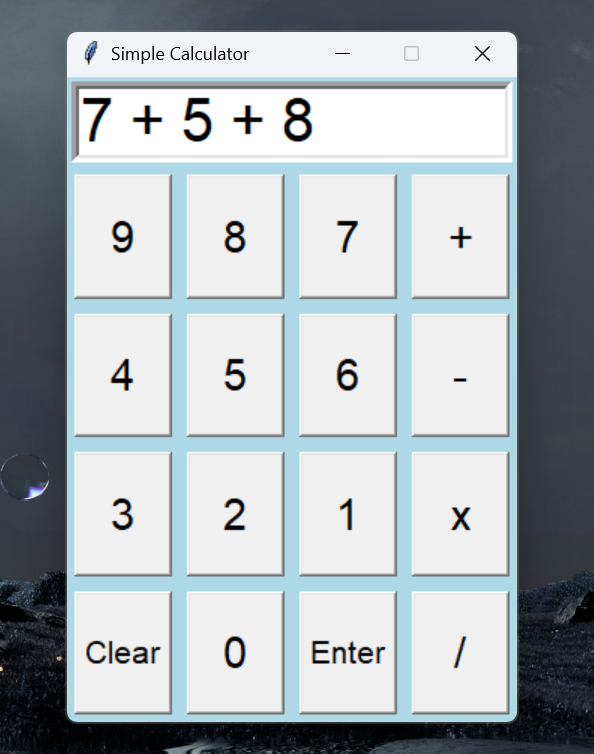
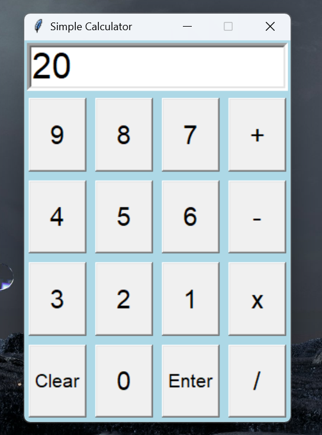

# Calculator

### Project Description:
This project showcases the use of Python along with the Graphical User Interface (GUI) library, __Tkinter__. The aim was to demonstrate the capabilities of __Tkinter__ in creating practical applications. Through this project, a basic calculator with simple operational functions was developed, to illustrate the ease and effectiveness of utilizing Tkinter for GUI development.

### How it runs:
This program enables users to interact with the calculator's buttons within the GUI window. Once the desired inputs are entered, pressing the __Enter__ button triggers the program to process the text in the entry box and display the result of the specified operations. If a new input is desired, then pressing __clear__ will eliminate any text inside the entry box to restore the opportunity to enter a new operation.

### Screenshots of Project:

#### Basic Calculator User Interface 1:

#### Basic Calculator Functions:

#### Notice: The previous image displayed the calculator with an entry box showing "7 + 5 + 8", and upon pressing the button __Enter__, the calculation is performed and the output is __20__. 

