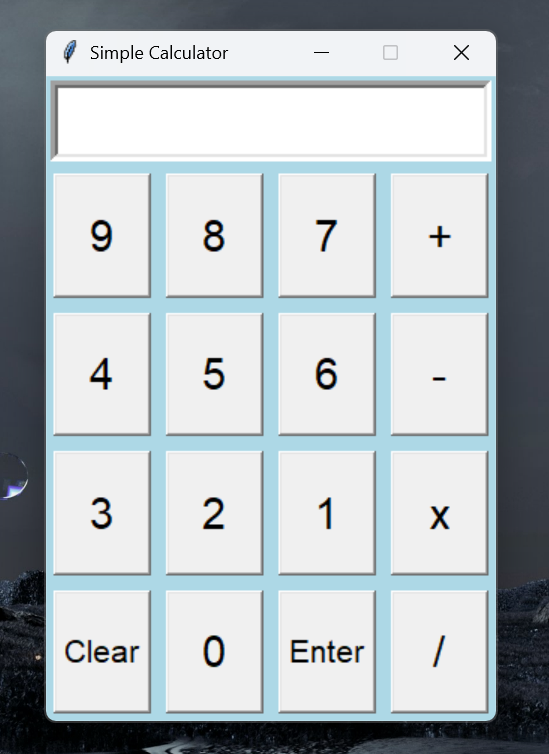

# Calculator

### Project Description:
This projects consists of python code and the use of a Graphical User Interface (GUI) library known as __Tkinter__. The purpose of this project was to showcase the utlization of __Tkinter__ and to demstrate its capability for project creation. While using this library, it was easy to create a calculator with basic functions that could perform simple operations.

### How it runs:
The program behind the scenes allows the user to utilize the buttons within the window of the calculator and when the calculation is ready to be initialized, the __Enter__ button is pressed and the program analyzes the current text in the entry box to output a number based on the operations.

### Screenshots of Project:

### Video Demo: 
